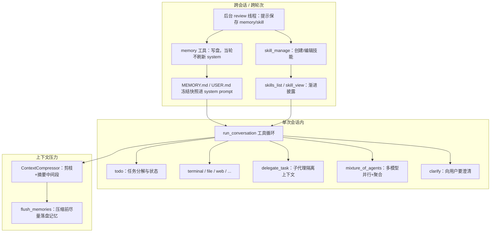
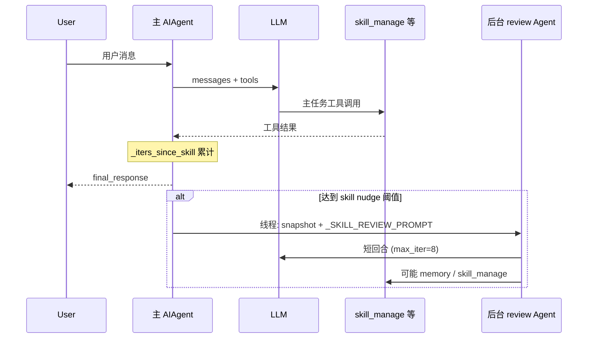

# Hermes Agent「自主进化」与长期能力：代码走读教程（中文）

本文从**实际代码路径**说明 Hermes Agent 如何支持：**可积累的程序性知识（Skills）**、**跨会话记忆**、**对话上下文压缩**、**疑难推理与分工（子代理 / MoA）**，以及**在模型故障或空回复时的绕行策略**。

> **重要前提**：这里的「进化」不是强化学习里**权重自修改**意义上的进化，而是指——通过工具与后台线程，把对话中验证过的做法**外化为可复用资产**（`~/.hermes/skills/` 下的 SKILL）、把稳定事实**写入持久存储**（`memories/*.md` 或外部记忆插件），以及在上下文逼近上限时**有损压缩历史**。这是工程上的「行为与知识累积」，而非模型本身的在线训练。

---

## 1. 总览：能力分层



---

## 2. 主循环：`AIAgent.run_conversation`

所有「会不会用工具、会不会压缩、会不会切 fallback」都发生在 `run_agent.py` 的 `AIAgent` 中。核心结构可概括为：

1. 组装 `messages`（含历史）、缓存的 **system prompt**（为前缀缓存稳定，通常不在会话中途重建）。
2. **预检压缩**：若历史已超新模型窗口，先压缩再进循环（避免直接 4xx）。
3. `while api_call_count < max_iterations and iteration_budget.remaining > 0`：调用 LLM → 若有 `tool_calls` 则执行 → 把结果写回 `messages`。
4. 每轮后根据 **真实 token usage** 判断 `context_compressor.should_compress()`，触发则调用 `_compress_context()`。
5. 回合结束：外部记忆 `sync` / `prefetch`；按需启动**后台 memory/skill review**。

与「疑难处理」直接相关的分支还包括：**provider fallback 链**、**空回复/仅思考时的续写或回退**、**迭代预算**（`IterationBudget`）。

---

## 3. 自主创建 / 更新 Skill：三层机制

### 3.1 渐进披露（Progressive Disclosure）

技能不是一次性塞进 system prompt 的全文，而是：

| 层级 | 工具 | 作用 |
|------|------|------|
| 1 | `skills_list` | 仅元数据（名称、描述等），省 token |
| 2 | `skill_view(name)` | 加载完整 `SKILL.md` |
| 3 | `skill_view(name, file_path)` | 加载某引用文件 |

实现见 `tools/skills_tool.py`（模块文档与 `skills_list` / `skill_view` 函数）。工具集在 `toolsets.py` 的 `skills` 工具集中注册 `skills_list`, `skill_view`, `skill_manage`。

### 3.2 代理主动写技能：`skill_manage`（`skill_manager_tool.py`）

`tools/skill_manager_tool.py` 头部设计说明写得很清楚：

- **Skills = 程序性记忆**：记录「某类任务怎么做」；**MEMORY/USER** 更偏声明式事实与用户画像。
- 支持 `create` / `edit` / `patch` / `delete` / `write_file` / `remove_file`，目录在 `get_hermes_home() / "skills"`（多 profile 下随 `HERMES_HOME` 隔离）。
- 创建后会走 `tools/skills_guard.py` 的安全扫描（与 Hub 安装同级），恶意模式可被拦截。

这与「进化」的关系：**成功路径被固化成可复用文档**，下次同类任务先 `skills_list` → `skill_view`，减少试错。

### 3.3 周期性「轻推」+ 后台审查：不抢主任务注意力

配置项 `skills.creation_nudge_interval`（默认 10）在 `AIAgent.__init__` 中读入为 `_skill_nudge_interval`：

```1235:1241:run_agent.py
        # Skills config: nudge interval for skill creation reminders
        self._skill_nudge_interval = 10
        try:
            skills_config = _agent_cfg.get("skills", {})
            self._skill_nudge_interval = int(skills_config.get("creation_nudge_interval", 10))
        except Exception:
            pass
```

**计数逻辑**（简化描述）：

- 每进入一次「要带工具调用的 API 迭代」且启用了 `skill_manage`，`_iters_since_skill` 自增。
- 若本轮实际执行了 `skill_manage`，在 `_execute_tool_calls_concurrent` 里把计数**清零**（避免刚写过还反复提醒）。

```6878:6882:run_agent.py
            # Reset nudge counters
            if function_name == "memory":
                self._turns_since_memory = 0
            elif function_name == "skill_manage":
                self._iters_since_skill = 0
```

当 `_iters_since_skill >= _skill_nudge_interval` 且回合正常结束，会触发 `_spawn_background_review(..., review_skills=True)`：

```10362:10390:run_agent.py
        # Check skill trigger NOW — based on how many tool iterations THIS turn used.
        _should_review_skills = False
        if (self._skill_nudge_interval > 0
                and self._iters_since_skill >= self._skill_nudge_interval
                and "skill_manage" in self.valid_tool_names):
            _should_review_skills = True
            self._iters_since_skill = 0
        ...
        if final_response and not interrupted and (_should_review_memory or _should_review_skills):
            try:
                self._spawn_background_review(
                    messages_snapshot=list(messages),
                    review_memory=_should_review_memory,
                    review_skills=_should_review_skills,
                )
```

`_spawn_background_review` 会再起一个 **`max_iterations=8` 的安静版 `AIAgent`**，把当前 `messages` 快照接上审查提示词，仅允许通过工具写共享的 memory/skill；**stdout/stderr 重定向到 `/dev/null`**，用户主会话看不到这次「反思」的流式输出：

```2151:2197:run_agent.py
    def _spawn_background_review(
        self,
        messages_snapshot: List[Dict],
        review_memory: bool = False,
        review_skills: bool = False,
    ) -> None:
        """Spawn a background thread to review the conversation for memory/skill saves.
        ...
        """
        ...
        def _run_review():
            ...
                    review_agent = AIAgent(
                        model=self.model,
                        max_iterations=8,
                        quiet_mode=True,
                        platform=self.platform,
                        provider=self.provider,
                    )
                    review_agent._memory_store = self._memory_store
                    ...
                    review_agent.run_conversation(
                        user_message=prompt,
                        conversation_history=messages_snapshot,
                    )
```

审查用的 `_SKILL_REVIEW_PROMPT` 明确要求：只有「非平凡、有试错或改路线」的经验才值得写入或更新技能：

```2127:2134:run_agent.py
    _SKILL_REVIEW_PROMPT = (
        "Review the conversation above and consider saving or updating a skill if appropriate.\n\n"
        "Focus on: was a non-trivial approach used to complete a task that required trial "
        "and error, or changing course due to experiential findings along the way, or did "
        "the user expect or desire a different method or outcome?\n\n"
        "If a relevant skill already exists, update it with what you learned. "
        "Otherwise, create a new skill if the approach is reusable.\n"
        "If nothing is worth saving, just say 'Nothing to save.' and stop."
    )
```



---

## 4. 长期记忆：内置文件 + 冻结快照 + 可选插件

### 4.1 内置：`MemoryStore`（`tools/memory_tool.py`）

核心设计（注释即文档）：

- **`MEMORY.md`**：环境事实、项目约定、工具怪癖等。
- **`USER.md`**：用户偏好、沟通风格等。
- **会话开始时**把内容渲染进 system prompt；**会话中途** `memory` 工具写入会立即落盘，但**故意不更新 system prompt**，以保护前缀缓存（与 Anthropic 等平台的 prompt caching 策略一致）。

```11:14:tools/memory_tool.py
Both are injected into the system prompt as a frozen snapshot at session start.
Mid-session writes update files on disk immediately (durable) but do NOT change
the system prompt -- this preserves the prefix cache for the entire session.
The snapshot refreshes on the next session start.
```

`MemoryStore` 类内维护 `_system_prompt_snapshot` 与 live entries 的双轨状态（见同文件 `MemoryStore` 文档字符串）。

### 4.2 Memory nudge + 后台 review（与 Skill 对称）

- `memory.nudge_interval`（代码里 `_memory_nudge_interval`）按**用户回合**计数；到期则 `_should_review_memory=True`。
- 用户在本轮若调用了 `memory` 工具，`_turns_since_memory` 在工具执行前被清零（同上 `_execute_tool_calls_concurrent` 片段）。
- 回合结束后与 skill 一样走 `_spawn_background_review`，提示词为 `_MEMORY_REVIEW_PROMPT` 或合并版 `_COMBINED_REVIEW_PROMPT`。

### 4.3 外部记忆插件：`MemoryManager`（`agent/memory_manager.py`）

- 内置 provider 始终存在；**最多一个**外部 provider（避免工具 schema 爆炸与后端冲突）。
- 生命周期：`initialize` → `build_system_prompt` → 每轮 `prefetch`（注入到**当前用户消息 API 副本**，不污染持久化的 `messages` 列表）→ `sync_turn`。
- `on_pre_compress`：在上下文压缩丢弃大量历史前，给插件一次抽取机会（接口定义于 `agent/memory_provider.py`）。

`run_agent.py` 中 `_build_system_prompt` 会把内置 memory 块与 `_memory_manager.build_system_prompt()` 拼进最终 system 字符串：

```3186:3203:run_agent.py
        if self._memory_store:
            if self._memory_enabled:
                mem_block = self._memory_store.format_for_system_prompt("memory")
                ...
            if self._user_profile_enabled:
                user_block = self._memory_store.format_for_system_prompt("user")
                ...
        if self._memory_manager:
            try:
                _ext_mem_block = self._memory_manager.build_system_prompt()
                if _ext_mem_block:
                    prompt_parts.append(_ext_mem_block)
```

API 调用前把 prefetch 注入到**当前轮 user 消息的副本**（不修改 `messages` 里持久结构）：

```7988:8004:run_agent.py
                if idx == current_turn_user_idx and msg.get("role") == "user":
                    _injections = []
                    if _ext_prefetch_cache:
                        _fenced = build_memory_context_block(_ext_prefetch_cache)
                        if _fenced:
                            _injections.append(_fenced)
                    ...
                    if _injections:
                        _base = api_msg.get("content", "")
                        if isinstance(_base, str):
                            api_msg["content"] = _base + "\n\n" + "\n\n".join(_injections)
```

`build_memory_context_block` 用 `<memory-context>` 围栏标注「这是召回背景，不是新用户输入」，降低模型把记忆当新指令的风险。

---

## 5. 「记忆压缩」的两种含义

### 5.1 对话上下文压缩（Context Compaction）

这是 **`agent/context_compressor.py`** 中的 `ContextCompressor`，由 `context.engine: compressor`（默认）驱动。

**算法概要**（与 `compress()` 文档一致）：

1. **剪枝**：旧 tool 结果替换为占位符，无需 LLM。
2. **保护头**：system + 前几轮（`protect_first_n`）。
3. **保护尾**：按 token 预算保留最近一段（`tail_token_budget`），而非死板「最后 N 条」。
4. **摘要中间段**：用辅助/摘要模型生成结构化摘要；多次压缩时会**迭代更新**已有摘要。
5. **清理**：`_sanitize_tool_pairs` 避免 tool_call / tool_result 孤儿对。

```666:674:agent/context_compressor.py
    def compress(self, messages: List[Dict[str, Any]], current_tokens: int = None, focus_topic: str = None) -> List[Dict[str, Any]]:
        """Compress conversation messages by summarizing middle turns.

        Algorithm:
          1. Prune old tool results (cheap pre-pass, no LLM call)
          2. Protect head messages (system prompt + first exchange)
          3. Find tail boundary by token budget (~20K tokens of recent context)
          4. Summarize middle turns with structured LLM prompt
          5. On re-compression, iteratively update the previous summary
```

摘要前缀 `SUMMARY_PREFIX` 明确告诉模型：这是**交接背景**，不要回答摘要里的旧问题，只响应摘要之后的最新用户消息（减少「死上下文复活」）。

**压缩前记忆 flush**：`_compress_context` 会先 `flush_memories(...)`，并调用外部 memory 的 `on_pre_compress`，再执行 `compress`：

```6660:6670:run_agent.py
        # Pre-compression memory flush: let the model save memories before they're lost
        self.flush_memories(messages, min_turns=0)

        # Notify external memory provider before compression discards context
        if self._memory_manager:
            try:
                self._memory_manager.on_pre_compress(messages)
            except Exception:
                pass

        compressed = self.context_compressor.compress(messages, current_tokens=approx_tokens, focus_topic=focus_topic)
```

压缩后还会把 **todo 列表** 重新注入（避免长任务状态随中间消息被删掉）：

```6672:6674:run_agent.py
        todo_snapshot = self._todo_store.format_for_injection()
        if todo_snapshot:
            compressed.append({"role": "user", "content": todo_snapshot})
```

### 5.2 持久记忆文件的「容量管理」

`MEMORY.md` / `USER.md` 有**字符上限**（配置 `memory_char_limit` / `user_char_limit`），由 `memory` 工具的 bounded 逻辑与 agent 侧指引共同约束；满了需要模型**合并或替换**条目（见 `website/docs/user-guide/features/memory.md` 与 `MEMORY_GUIDANCE` in `agent/prompt_builder.py`）。

---

## 6. 疑难问题处理：分工、多模型、规划、澄清

### 6.1 子代理 `delegate_task`（`tools/delegate_tool.py`）

**典型用途**：调试、代码审查、研究会淹没上下文的中间产物；或**并行**多条独立研究线。

机制要点：

- 子代理是**新的 `AIAgent`**，**没有父对话历史**；必须把路径、错误、约束写进 `context`。
- 父上下文只看到 **delegation + 最终 JSON 摘要**，不见子代理中间 tool/reasoning。
- **禁止递归过深**：`MAX_DEPTH = 2`；子代理不能再 delegate。
- **子代理禁用**：`delegate_task`, `clarify`, `memory`, `send_message`, `execute_code` 等（见 `DELEGATE_BLOCKED_TOOLS` 与 schema 描述）。

这对应一种「分而治之」的疑难拆解，而不是在一个窗口里堆全部尝试记录。

### 6.2 Mixture-of-Agents（`tools/mixture_of_agents_tool.py`）

启用 `moa` 工具集时，主代理可调用 **`mixture_of_agents`**：多路「参考模型」并行生成，再由「聚合模型」合成答案（见文件头论文引用与 `REFERENCE_MODELS` / `AGGREGATOR_MODEL` 常量）。

这更接近**集成式疑难推理**（多视角 + 批判性综合），成本显著高于单模型，适合「极难且值得」的问题。

### 6.3 `todo` 工具（`tools/todo_tool.py`）

会话内 **`TodoStore`**：分解任务、更新状态；压缩后会 **re-inject**（上一节）。适合长链路问题上的**进度锚定**，减少模型在冗长对话中丢失目标。

### 6.4 `clarify`（`tools/clarify_tool.py`）

当信息不足或存在歧义时，通过回调向用户提问。**子代理不能使用**（无交互通道），疑难路径上应由主代理收集信息后再 delegate。

---

## 7. 「绕过」困难：工程上的退路（非取巧）

### 7.1 Provider / 模型 Fallback 链

`AIAgent` 支持 `fallback_model` 或链式列表；在速率限制、部分非重试错误、空回复等路径上可 **`_try_activate_fallback()`** 切换到下一 provider/model，并同步更新压缩器等上下文长度相关状态（见 `run_agent.py` 中 `_try_activate_fallback` 及错误分类逻辑）。

### 7.2 迭代预算与特例退款

主循环受 `max_iterations` 与 `IterationBudget` 约束；若一轮仅包含 **`execute_code`** 工具调用，会 **refund** 该轮预算（避免简单 RPC 式调用快速耗尽额度）——见 `run_agent.py` 中 `if _tc_names == {"execute_code"}: self.iteration_budget.refund()` 附近。

### 7.3 空内容与「仅思考」恢复

当模型在 tool call 后返回空正文时，可能回用上一轮带工具时的可见内容，或进入「结构化推理续写」分支（见 `run_agent.py` 约 9940–9976 行附近的注释与逻辑），避免无意义重试烧预算。

### 7.4 诚实的边界

- **无法保证**一定解出数学/系统上的硬难题；上述机制是**资源与上下文管理** + **知识外化**。
- 子代理**无记忆工具**：长期沉淀仍应通过主会话的 `memory` / `skill_manage` 或外部 memory 完成。

---

## 8. 与 AGENTS.md 中「缓存纪律」的关系

仓库规则强调：**不要在中途改 system、不要中途换 toolset、不要为刷新记忆重建 system prompt**（成本与缓存失效）。本文涉及的机制均围绕该约束设计：

| 机制 | 是否符合「前缀缓存友好」 |
|------|-------------------------|
| 会话内 memory 写盘但不改 system | 是（`MemoryStore` 设计） |
| prefetch 仅注入 API 消息副本 | 是 |
| 压缩后 `_invalidate_system_prompt()` 重建 | 是（压缩是明确的上下文工程事件） |
| 后台 review 独立 Agent + 静默 I/O | 是（不污染主会话消息链） |

---

## 9. 建议阅读顺序（源码）

1. `run_agent.py` — `AIAgent.run_conversation`、`_compress_context`、`_spawn_background_review`、工具执行与压缩触发段。
2. `tools/memory_tool.py` — `MemoryStore` 双轨状态与 `memory` 工具。
3. `agent/memory_manager.py` / `agent/memory_provider.py` — 插件记忆契约。
4. `agent/context_compressor.py` — 压缩五阶段与 `SUMMARY_PREFIX` 语义。
5. `tools/skills_tool.py` + `tools/skill_manager_tool.py` — 渐进披露与写技能。
6. `tools/delegate_tool.py` — 子代理隔离与禁用列表。
7. `tools/mixture_of_agents_tool.py` — MoA 并行与聚合。
8. `tools/todo_tool.py` — 会话内规划状态与压缩后注入。

---

## 10. 小结表

| 用户直觉 | Hermes 实现要点 | 主要文件 |
|-----------|-----------------|----------|
| 自主进化 | 外化：skill_manage + 周期性后台 review | `run_agent.py`, `tools/skill_manager_tool.py` |
| 头脑风暴 / 多角度 | MoA 多模型；或 delegate 并行子任务 | `tools/mixture_of_agents_tool.py`, `tools/delegate_tool.py` |
| 长期记忆 | MEMORY/USER 文件 + 冻结 system 快照；可选外部 provider | `tools/memory_tool.py`, `agent/memory_manager.py` |
| 记忆压缩 | 对话 compaction（摘要中间段）；压缩前 flush + `on_pre_compress` | `agent/context_compressor.py`, `run_agent.py` |
| 疑难拆解 | todo + delegate + MoA + clarify | `tools/todo_tool.py`, `tools/delegate_tool.py`, … |
| 绕行 / 韧性 | fallback 链、预算、空回复恢复、压缩减压 | `run_agent.py` |

---

*文档生成自 hermes-agent 仓库当前结构；配置键与默认值以你本地的 `hermes_cli/config.py` 及文档站点为准。*
