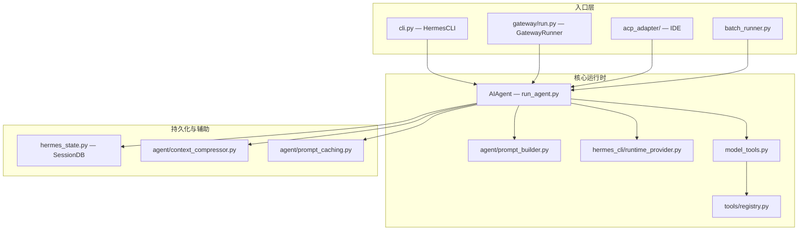
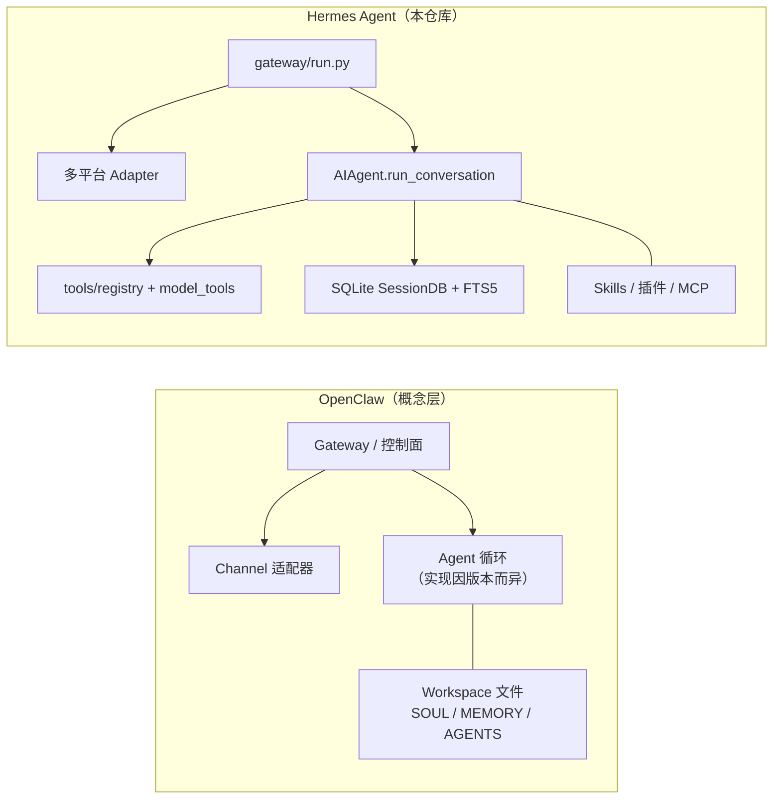

# Hermes Agent 核心代码逻辑与 OpenClaw 对比分析

本文基于 Hermes Agent 仓库源码与官方文档整理，并对照仓库内 **OpenClaw 迁移指南**、README 与第三方公开资料中对 OpenClaw 架构的描述。**OpenClaw 为独立项目**，若其上游实现变更，请以 OpenClaw 官方仓库为准；下文中涉及 OpenClaw 实现细节且非本仓库直接引用的部分，会标注为「公开资料归纳」。

---

## 1. 执行摘要

| 维度 | Hermes Agent（本仓库） | OpenClaw（归纳） |
|------|------------------------|------------------|
| **Agent 运行时** | 自包含的 `AIAgent`（`run_agent.py`），同步主循环 + 丰富 Provider/压缩/缓存逻辑 | 公开资料常描述为「网关 + 渠道」为中心；部分文章称核心对话循环可委托给其他 Agent 框架（如 Pi） |
| **配置与数据根目录** | `HERMES_HOME`（`~/.hermes`），**多 Profile** 隔离 | 默认 `~/.openclaw`、`openclaw.json`；迁移文档提及 `workspace-main/`、`workspace-{agentId}` 等多工作区布局 |
| **工具扩展** | `tools/registry.py` 集中注册 + `model_tools.py` 发现/分发 + MCP/插件动态扩展 | 同样有工具/注册概念；Hermes 提供 `hermes claw migrate` 映射 MCP 与密钥 |
| **会话与检索** | SQLite + FTS5（`hermes_state.py`）、会话血缘、增量落盘 | 迁移路径以 Markdown 记忆（`MEMORY.md` 等）为主；向量检索在公开资料中有提及，非本仓库可证实 |
| **产品差异化** | 内置技能进化、会话搜索、Honcho 用户建模、六种终端后端、RL/轨迹、Prompt 缓存策略等 | 强渠道集成与网关叙事；Hermes README 强调「自带学习闭环」与多模型无锁 |

---

## 2. Hermes 系统架构总览

官方架构图思路与 `website/docs/developer-guide/architecture.md` 一致，下面用 Mermaid 概括**调用链**与**子系统边界**。



**要点：**

- 所有用户可见入口最终汇聚到 **`AIAgent.run_conversation()`**。
- **工具**不是散落在 `run_agent.py` 的巨型 `if/elif`，而是通过 **`model_tools.handle_function_call()`** 派发到 `registry` 中注册的 handler。
- **系统提示、压缩、缓存**在 Agent 内部与 `agent/` 子包协作完成，且文档明确要求：**不在对话中途破坏 prompt 缓存前缀**（见 `AGENTS.md`）。

---

## 3. 核心代码路径：从用户输入到模型再回环

### 3.1 两条常用数据流

**CLI（简化）：**

```text
用户输入 → HermesCLI.chat() / process_input
  → AIAgent.run_conversation()
  → 组 prompt、选 provider/api_mode
  → chat.completions（或 Codex Responses / Anthropic Messages）
  → 若有 tool_calls → model_tools.handle_function_call()
  → 追加 tool 消息 → 继续循环
  → 无 tool_calls → final_response → 写 SessionDB
```

**Gateway：**

```text
平台事件 → Adapter → GatewayRunner._handle_message()
  → 鉴权、会话键、加载历史
  → AIAgent.run_conversation()
  → 经 Adapter 回传消息
```

（与 `website/docs/developer-guide/architecture.md` 中「Data Flow」一致。）

### 3.2 `AIAgent.run_conversation()` 的职责边界

`run_conversation` 在文件头注释与函数 docstring 中说明：负责完整多轮工具调用对话，直至结束。实际实现还包括：

- 中断（`interrupt`）、步进回调（`step_callback`，供 Gateway 钩子等）
- 三种 **API mode**：`chat_completions`、`codex_responses`、`anthropic_messages`
- 流式回调、TTS 管线、fallback 模型恢复
- **上下文压缩**与 **Anthropic prompt caching** 注入
- 外部记忆 `prefetch` 注入到**当前轮 API 副本**的用户消息侧，避免污染持久化会话与破坏缓存前缀
- `execute_code` 专用工具的 iteration budget **退款**等细节策略

### 3.3 主循环（核心逻辑）

主循环位于 `run_agent.py`，以 `api_call_count`、`max_iterations` 与 `iteration_budget` 为界，并在每轮检查用户中断。

```7919:7944:run_agent.py
        while (api_call_count < self.max_iterations and self.iteration_budget.remaining > 0) or self._budget_grace_call:
            # Reset per-turn checkpoint dedup so each iteration can take one snapshot
            self._checkpoint_mgr.new_turn()

            # Check for interrupt request (e.g., user sent new message)
            if self._interrupt_requested:
                interrupted = True
                _turn_exit_reason = "interrupted_by_user"
                if not self.quiet_mode:
                    self._safe_print("\n⚡ Breaking out of tool loop due to interrupt...")
                break
            
            api_call_count += 1
            self._api_call_count = api_call_count
            self._touch_activity(f"starting API call #{api_call_count}")

            # Grace call: the budget is exhausted but we gave the model one
            # more chance.  Consume the grace flag so the loop exits after
            # this iteration regardless of outcome.
            if self._budget_grace_call:
                self._budget_grace_call = False
            elif not self.iteration_budget.consume():
                _turn_exit_reason = "budget_exhausted"
                if not self.quiet_mode:
                    self._safe_print(f"\n⚠️  Iteration budget exhausted ({self.iteration_budget.used}/{self.iteration_budget.max_total} iterations used)")
                break
```

**一轮内对 API 消息的构造**（节选）：将外部记忆 prefetch、插件 `pre_llm_call` 钩子内容注入到 **API 副本** 的 user 消息，而不是改 system；system 侧拼接 `ephemeral_system_prompt`；可选插入 `prefill_messages`；再应用 prompt caching 与 orphan tool 清理等。

```7984:8065:run_agent.py
            api_messages = []
            for idx, msg in enumerate(messages):
                api_msg = msg.copy()

                # Inject ephemeral context into the current turn's user message.
                # Sources: memory manager prefetch + plugin pre_llm_call hooks
                # with target="user_message" (the default).  Both are
                # API-call-time only — the original message in `messages` is
                # never mutated, so nothing leaks into session persistence.
                if idx == current_turn_user_idx and msg.get("role") == "user":
                    _injections = []
                    if _ext_prefetch_cache:
                        _fenced = build_memory_context_block(_ext_prefetch_cache)
                        if _fenced:
                            _injections.append(_fenced)
                    if _plugin_user_context:
                        _injections.append(_plugin_user_context)
                    if _injections:
                        _base = api_msg.get("content", "")
                        if isinstance(_base, str):
                            api_msg["content"] = _base + "\n\n" + "\n\n".join(_injections)
                ...
            effective_system = active_system_prompt or ""
            if self.ephemeral_system_prompt:
                effective_system = (effective_system + "\n\n" + self.ephemeral_system_prompt).strip()
            ...
            if self._use_prompt_caching:
                api_messages = apply_anthropic_cache_control(api_messages, cache_ttl=self._cache_ttl, native_anthropic=(self.api_mode == 'anthropic_messages'))
            ...
            api_messages = self._sanitize_api_messages(api_messages)
```

**工具分支与压缩**（节选）：若模型返回 `tool_calls`，则追加 assistant 消息、执行 `_execute_tool_calls`（顺序或并发由配置决定），再按需压缩上下文并增量保存会话。

```9828:9937:run_agent.py
                    messages.append(assistant_msg)
                    self._emit_interim_assistant_message(assistant_msg)
                    ...
                    self._execute_tool_calls(assistant_message, messages, effective_task_id, api_call_count)
                    ...
                    _tc_names = {tc.function.name for tc in assistant_message.tool_calls}
                    if _tc_names == {"execute_code"}:
                        self.iteration_budget.refund()
                    ...
                    if self.compression_enabled and _compressor.should_compress(_real_tokens):
                        self._safe_print("  ⟳ compacting context…")
                        messages, active_system_prompt = self._compress_context(
                            messages, system_message,
                            approx_tokens=self.context_compressor.last_prompt_tokens,
                            task_id=effective_task_id,
                        )
                        ...
                    self._session_messages = messages
                    self._save_session_log(messages)
                    continue
```

以上三段代码共同体现了 Hermes **「同步循环 + 显式状态机式分支 + 成本敏感（缓存/压缩/budget）」** 的设计哲学。

---

## 4. 工具系统：`registry` 与 `model_tools`

### 4.1 设计模式

- 每个 `tools/*.py` 在 **import 时** 调用 `registry.register(...)`。
- `model_tools._discover_tools()` 负责按列表 `importlib.import_module`，从而收集 schema 与 handler。
- `handle_function_call` 为 `run_agent.py`、CLI、批量任务、RL 环境的统一入口。

```1:15:model_tools.py
"""
Model Tools Module

Thin orchestration layer over the tool registry. Each tool file in tools/
self-registers its schema, handler, and metadata via tools.registry.register().
This module triggers discovery (by importing all tool modules), then provides
the public API that run_agent.py, cli.py, batch_runner.py, and the RL
environments consume.
```

```1:15:tools/registry.py
"""Central registry for all hermes-agent tools.

Each tool file calls ``registry.register()`` at module level to declare its
schema, handler, toolset membership, and availability check.  ``model_tools.py``
queries the registry instead of maintaining its own parallel data structures.

Import chain (circular-import safe):
    tools/registry.py  (no imports from model_tools or tool files)
           ^
    tools/*.py  (import from tools.registry at module level)
           ^
    model_tools.py  (imports tools.registry + all tool modules)
           ^
    run_agent.py, cli.py, batch_runner.py, etc.
"""
```

### 4.2 与 Agent 的交界

部分工具（如 `todo`、部分 memory）在 `run_agent.py` 内被 **拦截** 以实现特殊语义（见 `AGENTS.md`）；其余走统一 `handle_function_call`。**Agent 级工具**与「普通工具」的划分是 Hermes 在可维护性与行为控制上的刻意设计。

---

## 5. 斜杠命令与配置：单一事实来源

`hermes_cli/commands.py` 中的 **`COMMAND_REGISTRY`** 是 CLI、Gateway、Telegram 菜单、Slack 子命令、自动补全等的**单一来源**，避免各入口命令不一致。这与「Agent 核心循环」正交，但极大影响**多平台产品一致性**。

---

## 6. OpenClaw 是什么（本仓库视角 + 公开资料）

### 6.1 本仓库直接提供的信息

- **迁移命令**：`hermes claw migrate`，从 `~/.openclaw`（或 `~/.clawdbot`、`~/.moltbot`）导入配置、记忆、技能、密钥等到 `HERMES_HOME`。
- **迁移映射**涵盖：`SOUL.md`、`MEMORY.md`/`USER.md`、技能目录、`openclaw.json` 中的模型与 provider、会话重置、MCP、TTS、执行超时与沙箱等（详见 `website/docs/guides/migrate-from-openclaw.md`）。
- **FAQ** 等文档讨论「多 WhatsApp 会话绑定多个 agent」等 OpenClaw 使用场景与 Hermes 的对应能力。

### 6.2 公开资料中常见的 OpenClaw 叙事（归纳，非本仓库源码）

多篇技术文章将 OpenClaw 描述为：

- 在本地或 VPS 上运行的 **网关型** 系统，统一接入 Telegram、WhatsApp、Slack 等；
- 强调 **WebSocket 控制面**、**渠道适配器**、**会话与路由**；
- 有文章称 **核心 Agent 循环** 可交由其他框架（例如 Pi）实现，OpenClaw 侧重「连接与编排」。

**注意**：若需严谨对比 OpenClaw 内部模块划分，应直接阅读 OpenClaw 官方仓库；上条为行业文章的归纳，可能存在过时或不准确之处。

---

## 7. 与 OpenClaw 的对比（架构视角）



| 对比项 | Hermes | OpenClaw（迁移文档 + 公开叙事） |
|--------|--------|--------------------------------|
| **状态根目录** | `HERMES_HOME`，Profile 切换（`hermes_constants`） | 默认 `~/.openclaw`，历史目录名兼容 |
| **人格与记忆文件** | `SOUL.md`、`memories/*.md` 等（迁移自 OpenClaw 路径） | `workspace/SOUL.md`、`workspace/MEMORY.md` 等，且存在 `workspace-main`、`workspace-{agentId}` |
| **Agent 实现位置** | 单体 `run_agent.py` 内完整循环与策略 | 本仓库不 vend OpenClaw 源码；公开资料强调网关与渠道 |
| **会话搜索** | FTS5 + 可选 LLM 摘要（README / 文档） | 迁移侧以 Markdown 为主；向量库多见于外部文章 |
| **终端执行** | 六种后端（local/Docker/SSH/Daytona/Modal/Singularity） | 迁移映射 `sandbox` → `terminal.backend` 等 |
| **研究向能力** | batch 轨迹、Atropos RL、`environments/agent_loop.py` | 非 Hermes 仓库关注点 |

---

## 8. Hermes 的核心优势（结合 README 与代码事实）

1. **自包含、可读的 Agent 运行时**  
   主循环、压缩、缓存、中断、budget、多 API 模式集中在 `AIAgent`，便于审计与定制；工具通过 registry 扩展，边界清晰。

2. **成本与上下文工程**  
   - Anthropic **prompt caching** 与「不把易变内容写进 system 前缀」的策略（见上文 `api_messages` 构造）。  
   - **上下文压缩**在 token 压力下触发，并与 usage 统计联动。

3. **多入口一致**  
   CLI、Gateway、ACP、cron、batch 共用同一套 `AIAgent` 与工具层，减少「平台一套逻辑、CLI 另一套」的分裂。

4. **Profile 与路径安全**  
   全项目强调 `get_hermes_home()` / `display_hermes_home()`，避免硬编码 `~/.hermes`，适配多实例。

5. **工具与运行环境**  
   终端多后端、浏览器、代码执行、delegate 子代理、MCP、插件 — 面向「真实工作负载」而非仅聊天。

6. **学习与记忆产品叙事**  
   README 强调：技能自进化、会话 FTS 搜索、Honcho 用户建模、agentskills.io 兼容等；这些在 OpenClaw 迁移文档中**部分对应**（记忆与技能导入），但 Hermes 将其作为**一等功能**深度集成。

7. **OpenClaw 用户迁移路径**  
   `hermes claw migrate` 与官方迁移文档降低切换成本，说明两个项目在用户心智与场景上高度重叠，Hermes 选择**正面兼容**。

---

## 9. 关键文件速查表

| 路径 | 作用 |
|------|------|
| `run_agent.py` | `AIAgent`：主循环、API 调用、工具调度触发、压缩、持久化 |
| `model_tools.py` | 工具发现、`get_tool_definitions`、`handle_function_call`、async 桥接 |
| `tools/registry.py` | 工具注册表单例 |
| `toolsets.py` | 工具集分组与平台预设 |
| `agent/prompt_builder.py` | 系统提示拼装 |
| `agent/context_compressor.py` | 默认上下文压缩引擎 |
| `agent/prompt_caching.py` | Claude / OpenRouter 等缓存控制注入 |
| `hermes_state.py` | SQLite 会话与 FTS |
| `gateway/run.py` | 消息网关主循环与分发 |
| `hermes_cli/commands.py` | 斜杠命令单一注册表 |
| `website/docs/guides/migrate-from-openclaw.md` | OpenClaw → Hermes 字段级映射 |

---

## 10. 延伸阅读

- 官方架构：`website/docs/developer-guide/architecture.md`
- Agent 循环细节：`website/docs/developer-guide/agent-loop.md`
- OpenClaw 迁移：`website/docs/guides/migrate-from-openclaw.md`
- 仓库贡献指南：`AGENTS.md`

---

## 11. 文档说明

- **生成日期**：以对话当日为准；代码引用中的行号随仓库版本可能变化，若不一致请以当前文件为准。  
- **版权声明**：Hermes Agent 由 Nous Research 维护（见仓库 README）；OpenClaw 为各自项目的商标/版权归属方所有。  
- 本文档位于仓库 `docs/hermes-core-logic-and-openclaw-comparison.md`，便于版本管理与评审。
